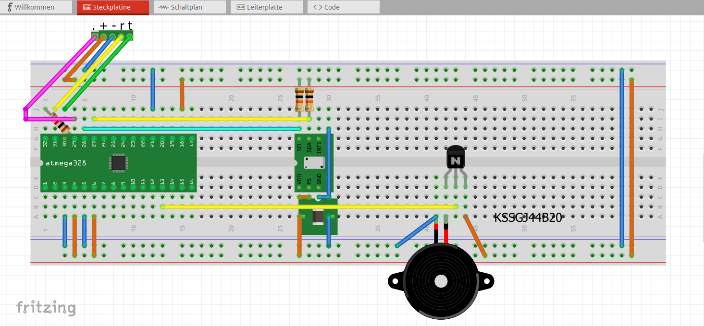
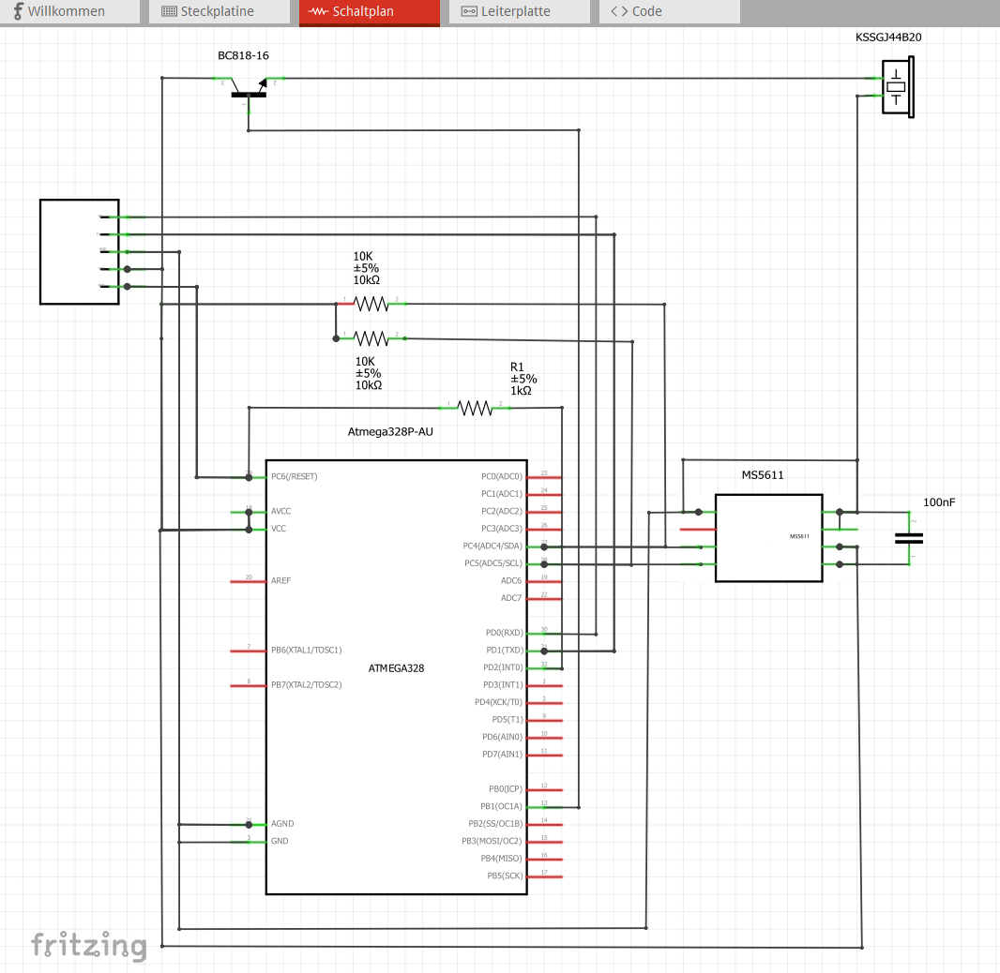

# Serial commands for variometer.
| Descripton            | command line   | value type |  value min             | value max                |
|-----------------------|----------------|------------|------------------------|--------------------------|
| set volume level      | $BVL VALUE*    |  INTEGER   |      0 - OFF           |   9 - max value          |
| set lift threshold    | $BUP VALUE*    |  INTEGER   |      0 - 0 m/s         | 400 - 4 m/s              |
| set sink threshold    | $BDW VALUE*    |  INTEGER   |      0 - 0 m/s         | 400 - 4 m/s              |
| lift/sink simulation  | $SIM VALUE*    |  INTEGER   |   -800 - 8m/s sink     | 800 - 8m/s lift          |
| reboot                | $RST VALUE*    |  INTEGER   |      0 - reboot now    |   x - reboot in x seconds| 

# First step create serial variometer.

Before ATMega328P chip is soldered it is very important to upload bootloader for 8MHz internal crystal through SPI interface.
The firmware can be uploaded with the serial interface, but not the bootloader.

|                             |                                               |
|-----------------------------|-----------------------------------------------|
|Serial Vario for BikePilot2  |                   |
|Public folder for Production |https://aisler.net/p/OTGDHGCV                  |
|Fritzing Project & PCB files |[./pcb](./pcb)                                 |
|Breakout boards              |   |
|Circuit diagram              ||
