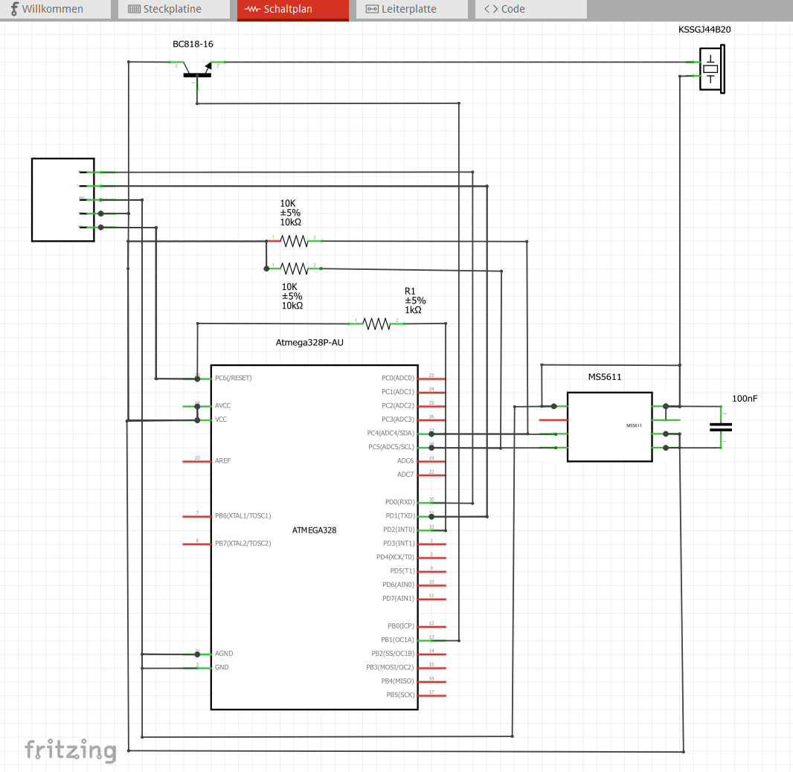

# Paragliding Variometer on Basis of Bikepilo2+ or Falk Tiger evo.

|                             |                                              |
|-----------------------------|----------------------------------------------|
|Video                        |https://youtube.com/shorts/pAdE8dn8gpc        |
|Vario                        |                 |
|XCSoar                       |                |
|Launcher                     |              |
|Serial Vario for BikePilot2  |                   |
|Public folder for Production |https://aisler.net/p/OTGDHGCV                 |
|Fritzing Project & PCB files |[./ATMega328P-AU/pcb](./ATMega328P-AU/pcb)    |
|Breakout boards              |   |
|Circuit diagram              ||
